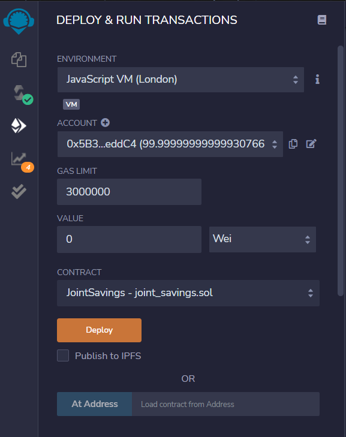
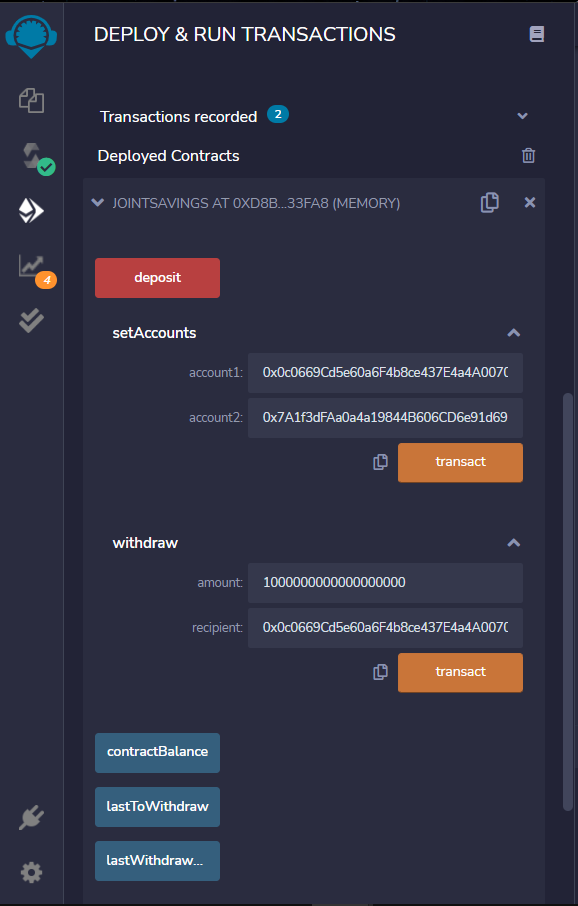
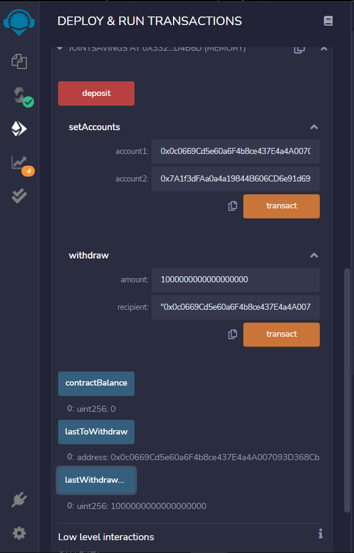
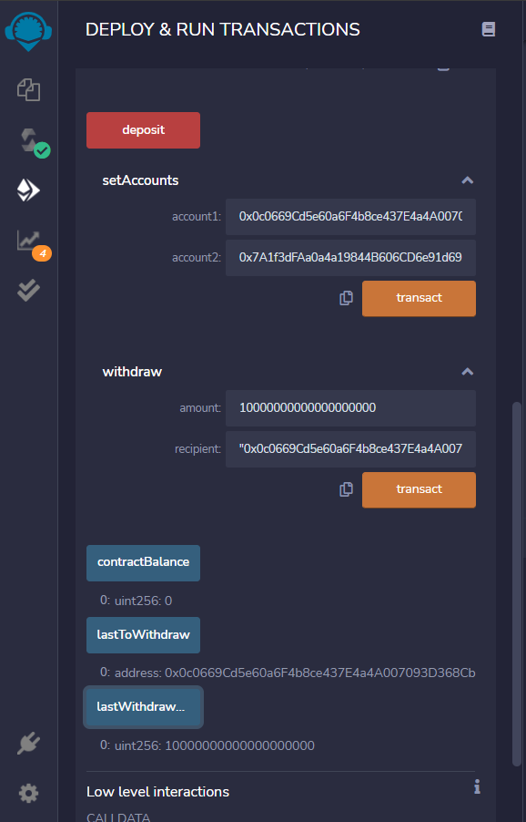
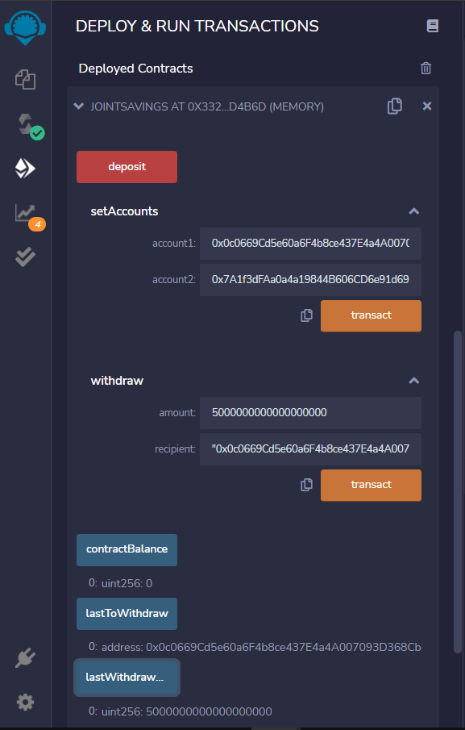

# Joint Savings Account

## Description
A fintech startup company has recently hired us. This company is disrupting the finance industry with its own cross-border, Ethereum-compatible blockchain that connects financial institutions. Currently, the team is building smart contracts to automate many of the institutions’ financial processes and features, such as hosting joint savings accounts.
To automate the creation of joint savings accounts, we’ll create a Solidity smart contract that accepts two user addresses. These addresses will be able to control a joint savings account. Our smart contract will use ether management functions to implement a financial institution’s requirements for providing the features of the joint savings account. These features will consist of the ability to deposit and withdraw funds from the account.

The goal is to create a completed Solidity JointSavings smart contract and a folder named Execution_Results with images. These images should confirm that the deposit and withdrawal transactions, which are designed to test the JointSavings functionality in the JavaScript VM, worked as expected.

## Ethereum Accounts
Dummy account1 address: 0x0c0669Cd5e60a6F4b8ce437E4a4A007093D368Cb  
Dummy account2 address: 0x7A1f3dFAa0a4a19844B606CD6e91d693083B12c0

## Images

### Compiled and Deployed Solidity Contract

### Defining Ethereum Addresses

### Transaction 1 (Send 1 ether as wei) with verification

### Transaction 2 (Send 10 ether as wei) with verification

### Transaction 3 (Send 5 ether as wei) with verification

## License 
 

Copyright © 2022 Matthew Guillen
